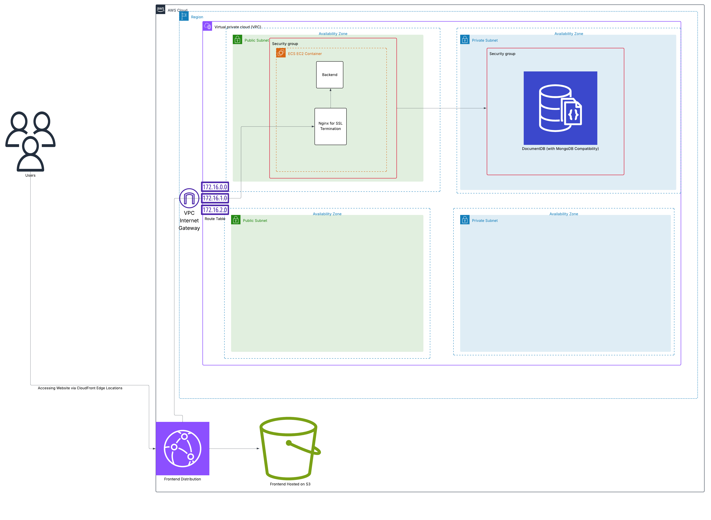
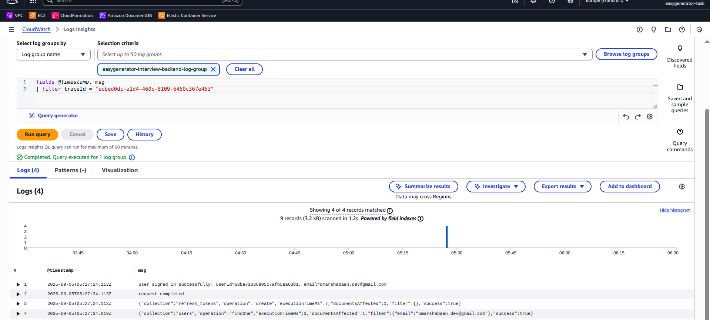

# Easygenerator Authentication System

A modern full-stack authentication system built with NestJS (backend) and React (frontend), featuring JWT-based authentication, secure session management, and MongoDB integration.


## 🏗️ Infrastructure




### AWS Deployment
Infrastructure code and deployment scripts are located in the `infrastructure/` directory.

## 🚀 Quick Start

### Prerequisites
- Docker and Docker Compose
- Node.js 18+ (for local development)
- Git

### Environment Setup
1. Copy the environment template:
```bash
cp .env.example .env.development
```

2. Update `.env.development` with your preferred values (optional - defaults work for local development)

### Running the Application

#### Full Stack (Recommended)
```bash
# Start all services (frontend, backend, database)
make dev

# Or manually
docker compose up -d
```

Access the application:
- **Frontend**: http://localhost:5173
- **Backend API**: http://localhost:3000
- **API Documentation**: http://localhost:3000/api/docs
- **MongoDB**: localhost:27017

#### Backend Only
```bash
# Navigate to backend directory
cd backend

# Start backend + database only
docker compose up -d
```

#### Development with Hot Reload
```bash
# Start with automatic code reloading
make dev

# View logs
make dev-logs
```

## 📋 Available Commands

### Development
- `make dev` - Start development environment
- `make dev-build` - Build and start development environment
- `make dev-logs` - Show development logs

### Service Management
- `make up` - Start all services
- `make down` - Stop all services
- `make restart` - Restart all services
- `make status` - Show service status

### Individual Services
- `make build-backend` - Rebuild backend only
- `make build-frontend` - Rebuild frontend only
- `make restart-backend` - Restart backend only
- `make restart-frontend` - Restart frontend only

### Logs
- `make logs` - Show all service logs
- `make logs-backend` - Show backend logs
- `make logs-frontend` - Show frontend logs
- `make logs-db` - Show MongoDB logs

### Database Management
- `make db-reset` - Reset MongoDB (⚠️ deletes all data)
- `make shell-db` - Access MongoDB shell


### Cleanup
- `make clean` - Remove containers and volumes
- `make clean-hard` - Nuclear cleanup (removes everything)

## 🛠️ Development

### Local Development Setup
```bash
# Install dependencies
make install

# Start development environment
make dev

# Run tests
make test
```

### Environment Variables
Key environment variables (see `.env.example` for full list):

| Variable | Description | Default |
|----------|-------------|---------|
| `NODE_ENV` | Environment mode | `development` |
| `BACKEND_PORT` | Backend server port | `3000` |
| `FRONTEND_PORT` | Frontend server port | `5173` |
| `MONGODB_PORT` | MongoDB port | `27017` |
| `JWT_SECRET` | JWT signing secret | *Change in production* |

### Project Structure
```
.
├── backend/           # NestJS backend application
├── frontend/          # React frontend application
├── docs/              # Project documentation and ADRs
├── mongodb/           # MongoDB initialization scripts
├── infrastructure/    # AWS/deployment configurations
├── docker-compose.yaml          # Main compose file
├── docker-compose.override.yaml # Development overrides
└── Makefile          # Development commands
```


### Architecture Overview
- **Frontend**: React with TypeScript, Vite build system
- **Backend**: NestJS with TypeScript, Express.js
- **Database**: MongoDB with Docker
- **Authentication**: JWT tokens with refresh mechanism
- **Containerization**: Docker with multi-stage builds
- **Development**: Hot reload, file watching, health checks

### Security Features
- JWT access/refresh token pattern
- Secure HTTP-only cookies
- CORS protection
- Input validation and sanitization
- Password hashing with bcrypt
- Security headers middleware

### Logging & Monitoring
- **Structured JSON Logging**: Uses Pino for structured JSON logs in production
- **CloudWatch Integration**: Logs are optimized for AWS CloudWatch Logs Insights
- **Request Correlation**: Each request has a unique `traceId` for tracking across services
- **Contextual Logging**: Logs include user context, service metadata, and request information

Example log structure:
```json
{
  "level": 30,
  "time": 1757050044112,
  "pid": 1,
  "service": "easygenerator-auth-backend",
  "environment": "production",
  "req": {
    "method": "POST",
    "url": "/api/auth/sign-in"
  },
  "traceId": "ecbed0dc-a1d4-460c-8109-6460c367e463",
  "msg": "User signed in successfully: userId=68ba71036a95c7afb5aa60b1, email=user@example.com"
}
```

**CloudWatch Logs Insights Queries**:
- Track user sessions: `fields @timestamp, traceId, msg | filter userId like /68ba71036a95c7afb5aa60b1/`
- Monitor authentication flows: `fields @timestamp, traceId, msg | filter url like /auth/ | sort @timestamp desc`
- Trace request lifecycle: `fields @timestamp, msg | filter traceId = "ecbed0dc-a1d4-460c-8109-6460c367e463"`


## 📝 API Documentation

Once running, visit https://be.easygenerator.omarshabaan.tech/api/docs for interactive API documentation (Swagger).

## 🔄 CI/CD Pipeline

### GitHub Actions Workflows
The project uses automated CI/CD with separate pipelines for frontend and backend:

#### **Frontend Pipeline**
- **Triggers**: Pull requests and pushes to `main` branch (frontend changes only)
- **CI**: Code quality checks, unit tests, build verification
- **Deployment**: S3 + CloudFront (zero downtime)
- **Live URL**: https://easygenerator.omarshabaan.tech

#### **Backend Pipeline**  
- **Triggers**: Pull requests and pushes to `main` branch (backend changes only)
- **CI**: Code quality checks, unit/integration tests, Docker build
- **Deployment**: ECS rolling deployment (brief downtime for cost optimization)
- **API URL**: https://be.easygenerator.omarshabaan.tech

#### **Pipeline Features**
- 🔒 OIDC authentication for secure AWS access
- 📊 Code coverage reporting via CodeCov
- 🏗️ Path-based triggers (only runs when relevant files change)
- ⚡ Optimized builds with Node.js caching

## 📖 Architecture Documentation

For detailed technical decisions and implementation details, see our Architecture Decision Records (ADRs):

- **[ADR-001: Frontend Authentication State Management](./docs/adr/001-frontend-authentication-state-management.md)** - Frontend authentication patterns and state management
- **[ADR-002: Backend Authentication Architecture](./docs/adr/002-backend-authentication-architecture-decisions.md)** - Backend security implementation and JWT handling
- **[ADR-003: SSL/TLS Configuration Strategy](./docs/adr/003-ssl-tls-configuration.md)** - SSL setup, cost optimization, and Nginx configuration
- **[ADR-004: Deployment Strategy and CI/CD Pipeline](./docs/adr/004-deployment-strategy.md)** - Deployment patterns, CI/CD workflows, and future roadmap

## 🚀 Deployment

### Production Build
```bash
make prod-build
make prod-up
```

### AWS Infrastructure
Infrastructure code and deployment scripts are located in the `infrastructure/` directory. See [ADR-004](./docs/adr/004-deployment-strategy.md) for detailed deployment strategy and [ADR-003](./docs/adr/003-ssl-tls-configuration.md) for SSL configuration details.


